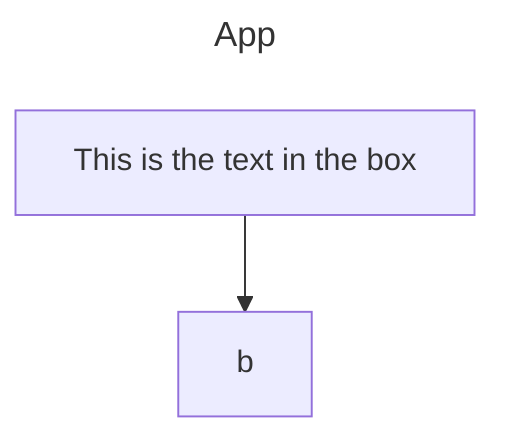

# Overview

Herein lies the descriptions of this app's game and backend functionality as a reference.

## App state

```ts
enum gameProgress {
  preplacement,
  prematching,
  placement,
  ongoing,

}

```

not to be confused with cookies state

`home` - displays 



